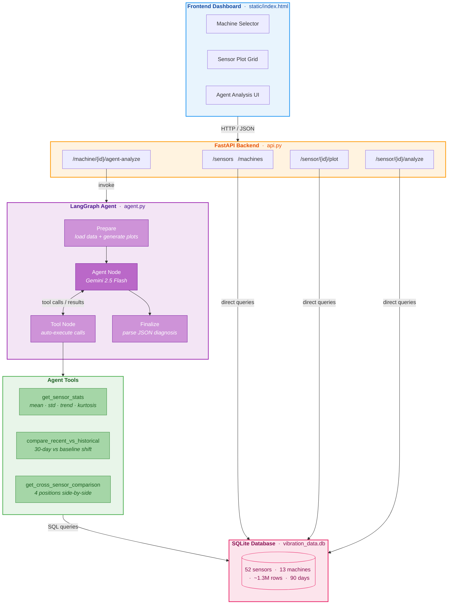
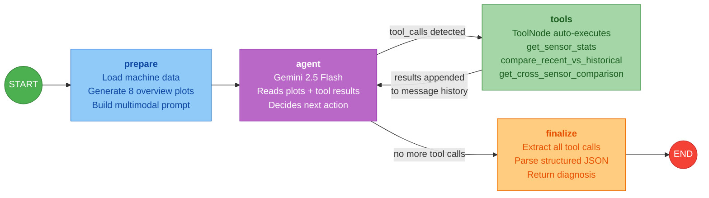

# Vibration Analysis — Agentic AI Diagnostics

An end-to-end vibration monitoring system that uses a **LangGraph agent** backed by Google Gemini to diagnose industrial machinery health. The agent receives sensor plots, then autonomously calls analytical tools (stats, trend detection, cross-sensor comparison) before producing a structured machine-level diagnosis.

## Architecture

### System Overview



### Agent Flow (LangGraph State Machine)



## Key Features

- **Agentic diagnosis** — the LLM doesn't just classify; it uses tools to gather quantitative evidence across all sensors on a machine before making a decision
- **Machine-level reasoning** — cross-references 4 sensor positions (drive end, non-drive end, gearbox, base) to identify fault mechanisms
- **Realistic synthetic data** — 3 fault categories (clearly healthy, clearly faulty, ambiguous) with correlated cross-sensor fault patterns
- **Interactive dashboard** — machine selector, per-sensor plot grids, one-click agent analysis with reasoning trace

## Tech Stack

| Layer | Technology |
|-------|-----------|
| Agent framework | LangGraph (state graph, tool nodes, conditional routing) |
| LLM | Google Gemini 2.5 Flash (multimodal — reads plots + calls tools) |
| LLM integration | LangChain (`langchain-google-genai`) |
| Backend | FastAPI + Uvicorn |
| Database | SQLite (via pandas) |
| Plotting | Matplotlib (thread-safe, no pyplot) |
| Frontend | Vanilla HTML/CSS/JS (single-file dashboard) |

## Project Structure

```
├── config.py            # Central configuration (model, DB path, constants)
├── models.py            # Pydantic schemas (shared across API + agent)
├── db.py                # Database connection management + reusable queries
├── plotting.py          # Shared scatter-plot renderer
│
├── generate_data.py     # Synthetic data generator (13 machines × 4 sensors)
├── query_data.py        # CLI database explorer + machine-level plots
│
├── agent.py             # LangGraph agentic analysis (graph + tools)
├── api.py               # FastAPI endpoints (data, plots, AI analysis)
│
├── static/index.html    # Frontend dashboard
├── tests/               # pytest suite (tools + API integration)
│
├── .env.example         # Template for required environment variables
├── requirements.txt     # Python dependencies
└── README.md
```

## Setup

```bash
# 1. Clone and enter the directory
git clone <repo-url>
cd Vib_Analysis

# 2. Create a virtual environment
python3 -m venv .venv
source .venv/bin/activate

# 3. Install dependencies
pip install -r requirements.txt

# 4. Set your Gemini API key
cp .env.example .env
# Edit .env and add your key (get one at https://aistudio.google.com/app/apikey)

# 5. Generate synthetic data
python generate_data.py

# 6. Start the server
uvicorn api:app --host 0.0.0.0 --port 8000

# 7. Open the dashboard
open http://localhost:8000
```

## Running Tests

```bash
pytest tests/ -v
```

Tests use an auto-generated in-memory database (no API key needed, no LLM calls).

## How the Agent Works

When you click **"Analyze Machine (AI Agent)"** in the dashboard:

1. **Prepare** — loads all sensor data for the machine, generates 8 overview scatter plots (X-axis accel + velocity for each of 4 positions)
2. **Agent** — sends the plots to Gemini with a diagnostic prompt and 3 bound tools
3. **Tool loop** — Gemini autonomously decides which tools to call:
   - `get_sensor_stats` — detailed per-sensor statistics (mean, std, trend slope, kurtosis)
   - `compare_recent_vs_historical` — detects degradation by comparing last 30 days vs baseline
   - `get_cross_sensor_comparison` — highlights anomalous positions relative to siblings
4. **Finalize** — parses the structured JSON diagnosis with per-sensor labels, overall machine verdict, and recommended action

The agent typically makes 5-8 tool calls before converging on a diagnosis.

## Data Model

Each machine has **4 sensors** at standardized positions with different vibration sensitivity:

| Position | Accel Multiplier | Typical Fault Signature |
|----------|-----------------|------------------------|
| Drive End | 1.00× | Bearing faults appear strongest here |
| Non-Drive End | 0.85× | Misalignment shows on both ends |
| Gearbox | 0.90× | Gear-mesh faults are localized here |
| Base | 0.65× | Structural looseness elevates base noise |

Three health categories are generated:
- **Healthy** (5 machines) — normal baseline vibration
- **Faulty** (3 machines) — clear fault signatures (bearing, misalignment, gear, looseness)
- **Ambiguous** (5 machines) — subtle patterns that require cross-sensor reasoning

## License

MIT
