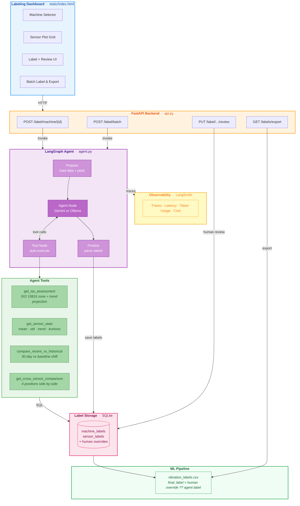
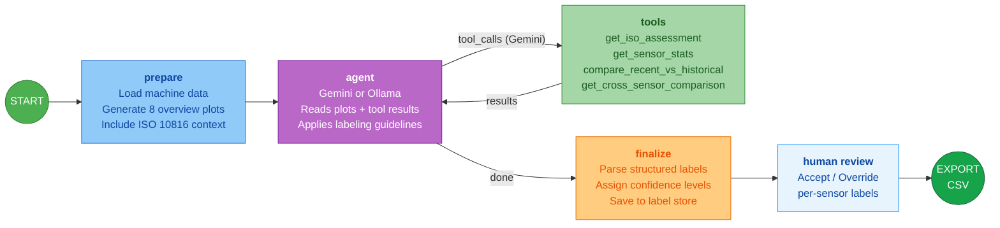

# VibLabel — Agentic Data Labeling for Vibration Analysis

An LLM-powered labeling tool that uses a **LangGraph agent** to generate quality labels for industrial vibration sensor data. Supports **dual providers** — Google Gemini (cloud) or Llama 3.2 Vision via Ollama (local) — selectable per-request from the dashboard. The labeled data is designed for training or validating machine learning models for predictive maintenance.

Instead of replacing ML inference, this tool **produces the training and validation data** that ML models need — automating what traditionally requires expensive domain experts annotating sensor readings by hand.

## Architecture

### System Overview



### Labeling Flow



## Why This Approach

| Challenge | How VibLabel solves it |
|-----------|----------------------|
| Labeled industrial data is expensive | LLM agent automates the domain-expert annotation workflow |
| Labels need to be grounded, not subjective | ISO 10816 zones provide objective severity criteria |
| Edge cases need human judgment | Human-in-the-loop review for low-confidence labels |
| Labels need to be explainable | Every label includes rationale, tool evidence, and ISO zone reference |
| ML models need structured training data | One-click CSV export with `final_label` column |
| Sensor data cannot leave the facility | Local SLM mode via Ollama — zero data leaves the device |

## Key Features

- **Agentic labeling** — the LLM uses tools to gather quantitative evidence before assigning labels, not just pattern-matching on plots
- **ISO 10816 grounded** — labels reference international vibration severity zones (A/B/C/D) with trend projections
- **Confidence scoring** — each label has a confidence level (high/medium/low) that prioritizes human review effort
- **Human-in-the-loop** — reviewers can accept or override agent labels per-sensor, with overrides taking precedence in exports
- **Batch processing** — label all unlabeled machines in one click
- **Dual provider** — switch between Gemini (cloud) and Llama 3.2 Vision via Ollama (local) per-request from the dashboard
- **ML-ready export** — CSV with `final_label` column (human override ?? agent label) for direct pipeline ingestion
- **LangSmith observability** — opt-in tracing of every agent run, tool call, and LLM invocation with latency, token usage, and cost tracking

## Tech Stack

| Layer | Technology |
|-------|-----------|
| Agent framework | LangGraph (state graph, tool nodes, conditional routing) |
| LLM (cloud) | Google Gemini 2.5 Flash via `langchain-google-genai` |
| LLM (local) | Llama 3.2 Vision 11B via Ollama + `langchain-ollama` |
| Backend | FastAPI + Uvicorn |
| Database | SQLite (sensor data + label storage) |
| Observability | LangSmith (opt-in tracing, token/cost tracking) |
| Plotting | Matplotlib (thread-safe, Figure API) |
| Frontend | Vanilla HTML/CSS/JS |

## Project Structure

```
├── config.py            # Central configuration (ISO thresholds, model, constants)
├── models.py            # Pydantic schemas (labeling, review, export)
├── db.py                # DB helpers + label storage (save, review, export)
├── plotting.py          # Shared scatter-plot renderer
│
├── generate_data.py     # Synthetic data generator (13 machines × 4 sensors)
├── query_data.py        # CLI database explorer
│
├── agent.py             # LangGraph agent (dual-provider, 4 tools incl. ISO assessment)
├── api.py               # FastAPI endpoints (label, review, export, data, plots)
│
├── static/index.html    # Labeling dashboard with human review
├── tests/               # pytest suite (tools + API endpoints)
├── scripts/             # Utility scripts (tracing verification, benchmarking)
│
├── .env.example         # Template for API keys (Gemini + LangSmith + Ollama)
├── requirements.txt     # Dependencies
└── README.md
```

## Setup

```bash
# 1. Clone and enter the directory
git clone <repo-url>
cd Vib_Analysis

# 2. Create a virtual environment
python3 -m venv .venv
source .venv/bin/activate

# 3. Install dependencies
pip install -r requirements.txt

# 4. Configure environment
cp .env.example .env
# Edit .env — add your Gemini key (https://aistudio.google.com/app/apikey)
# Optionally add your LangSmith key for observability (https://smith.langchain.com)

# 4b. (Optional) For local SLM mode — install Ollama and pull the model
brew install ollama
ollama pull llama3.2-vision:11b

# 5. Generate synthetic data
python generate_data.py

# 6. Start the server
uvicorn api:app --host 0.0.0.0 --port 8000

# 7. Open the dashboard
open http://localhost:8000
```

## Running Tests

```bash
pytest tests/ -v
```

## How the Labeling Works

1. **Select a machine** and choose a **provider** (Gemini or Ollama) from the dashboard
2. **Agent labels** — the LLM inspects 8 sensor plots, uses ISO assessment + statistical tools, and assigns per-sensor labels with confidence
3. **Review** — low-confidence labels are flagged; reviewers can accept or override any label
4. **Export** — download `vibration_labels.csv` where `final_label` = human override when present, otherwise agent label

### Labeling Guidelines (embedded in agent prompt)

| Condition | Label | Typical Confidence |
|-----------|-------|--------------------|
| ISO Zone A or stable B, no trend | healthy | high |
| Zone B with upward trend, borderline B/C | monitor | medium |
| Zone C or D, strong trend, clear fault | unhealthy | high |
| Conflicting cross-sensor signals | varies | low (flagged for review) |

## Observability (LangSmith)

Tracing is **opt-in**. When `LANGCHAIN_TRACING_V2=true` is set in `.env`, every agent invocation is traced to [LangSmith](https://smith.langchain.com) with:

- Full graph execution path (prepare → agent → tools → finalize)
- Per-tool inputs/outputs as child spans
- Gemini LLM token usage and cost
- `run_name`, `tags`, and `metadata` for filtering (single vs batch, by machine ID)

```bash
# Verify tracing is working
python scripts/test_tracing.py
```

When tracing is off (no env vars set), there is zero overhead — the agent runs identically.

## Local SLM Mode (Ollama)

For environments where sensor data cannot leave the facility, VibLabel supports fully local inference via Ollama + Llama 3.2 Vision 11B. The provider is selectable per-request from the dashboard dropdown — no server restart needed.

| | Gemini (Cloud) | Ollama (Local) |
|---|---|---|
| Architecture | Multi-turn tool calling | Single-pass with pre-computed tools |
| Model | Gemini 2.5 Flash | Llama 3.2 Vision 11B |
| Data privacy | Data sent to Google API | Zero data leaves the device |
| Tool execution | LLM decides which tools to call | All tools run upfront, results injected into prompt |
| Speed | Fast (API) | Depends on hardware |

```bash
# Benchmark local vs cloud
python scripts/benchmark_local_vs_cloud.py
```

The server default is controlled by `USE_LOCAL_SLM` in `.env`, but the dashboard dropdown overrides it per-request.

## Data Model

Each machine has **4 sensors** at standardized positions:

| Position | Accel Multiplier | ISO Relevance |
|----------|-----------------|---------------|
| Drive End | 1.00× | Bearing faults appear strongest here |
| Non-Drive End | 0.85× | Misalignment shows on both ends |
| Gearbox | 0.90× | Gear-mesh faults are localized here |
| Base | 0.65× | Structural looseness elevates base noise |

ISO 10816 machine class assignments:

| Machine Type | ISO Class | Zone B/C Boundary (vel RMS, mm/s) |
|-------------|-----------|-----------------------------------|
| Pump | Class II | 2.80 |
| Fan | Class I | 1.80 |
| Motor | Class III | 4.50 |

## License

MIT
